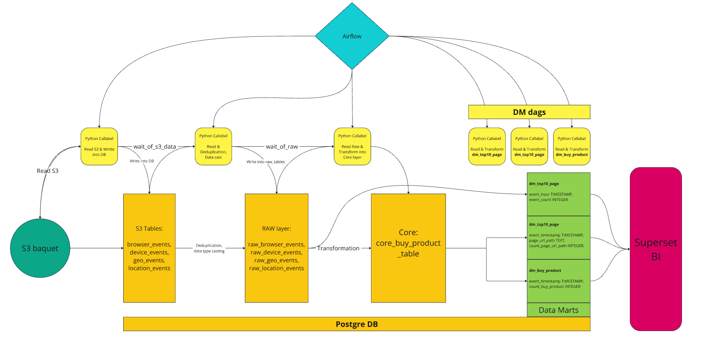

# de15_lab08

Описание инфраструктуры:
1. Airflow поднимается на порту 8082.
2. База данных postgres на порту 5438.
3. Superset поднимается на порту 8088.  

Airfolow последовательно запускает следующие даги:
1. Забирает данные с S3 в 4х тасках: get_browser_events, get_device_events, get_geo_events, get_location_events  
2. Данные из S3 дедуплицируются, приводятся типы данных в даге raw_layer, формируются таблицы raw слоя
3. Из raw слоя в даге data_core_update формируется промежуточная таблица для core слоя - core_buy_product_table
4. Готовые витрины собираются как из raw, так и из core, для вызова из Superset лежат здесь: dm_buy_product, dm_hourly_events, dm_top10_page 



## Перед запуском
Перед запуском проекта нужно указать учетные данные для доступа в yandex cloud в файле `env.cfg` :
```
...
AWS_SECRET_ID=YC**tX
AWS_SECRET_KEY=YC**5C
```
Учетные данные можно получить <a href="https://yandex.cloud/ru/docs/iam/operations/sa/create-access-key#console_1">по инструкции</a>
Также здесь  находятся все переменные для окружения AirFlow и Posgres.
Dockerfile для airflow, posgresql, а также ДАГи расположены в директории /airflow.  
**Важно!** Нужно проверить firewall системный и в облаке на предмет, что все указанные выше порты открыты.

## Запуск docker-compose stek posgresql-airflow

```shell
docker compose --env-file=env.cfg up -d
```

## Добавить admin пользователя AirFlow
`docker compose exec airflow-webserver bash`  
```shell
$ docker compose exec airflow-webserver bash
root@69562d622803:/usr/local/airflow# airflow users create -u admin -f Ad -l Min -r Admin -e admin@adm.in
[2022-05-10 12:05:39,359] {manager.py:807} WARNING - No user yet created, use flask fab command to do it.
[2022-05-10 12:05:39,450] {manager.py:585} INFO - Removed Permission menu access on Permissions to role Admin
[2022-05-10 12:05:39,462] {manager.py:543} INFO - Removed Permission View: menu_access on Permissions
[2022-05-10 12:05:39,505] {manager.py:508} INFO - Created Permission View: menu access on Permissions
[2022-05-10 12:05:39,510] {manager.py:568} INFO - Added Permission menu access on Permissions to role Admin
Password:
Repeat for confirmation:
[2022-05-10 12:05:47,312] {manager.py:213} INFO - Added user admin
User "admin" created with role "Admin"
root@69562d622803:/usr/local/airflow# 
```

Все переменные для окружения AirFlow и Posgres находятся в файле env.cfg в корневой директории.

## Добавить файлы Superset и файл docker-compose-non-dev.yml необходимо:

В любой директории выполнить `git clone https://github.com/apache/superset`  
Рекомендуем вам переключиться на стабильный релиз - например, на 4.1.1: `cd .\superset`, `git checkout 4.1.1`  
Для того, чтобы Superset увидел нашу сеть, нужно скопировать в него подготовленный настроечный файл:
`cp de15_lab08/superset_config/docker-compose-non-dev.yml superset/`

Запуск Superset
`docker compose -f superset/docker-compose-non-dev.yml up -d`

Остановка docker-compose:  
airflow&postgres `docker compose stop`  
superset `docker compose -f superset/docker-compose-non-dev.yml stop`